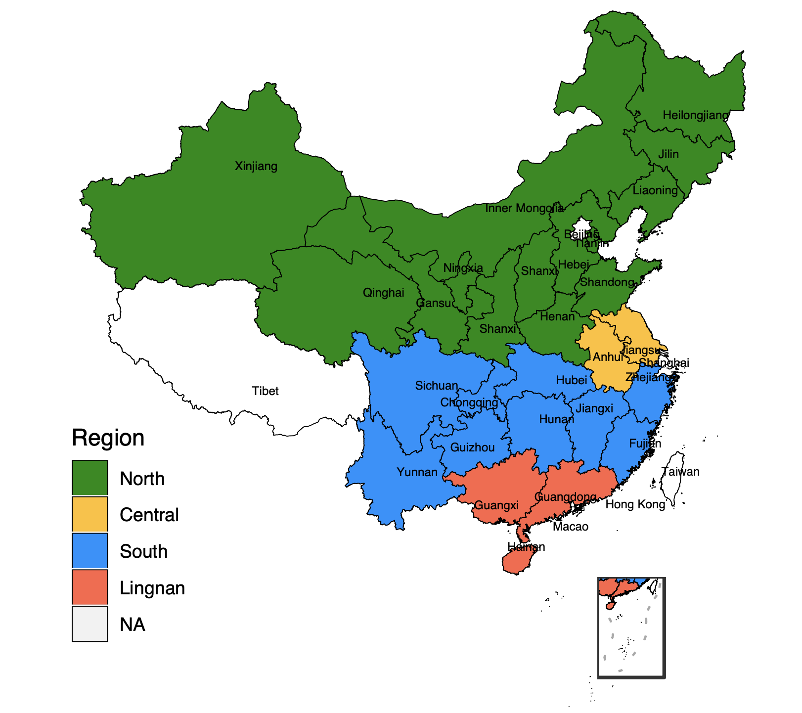
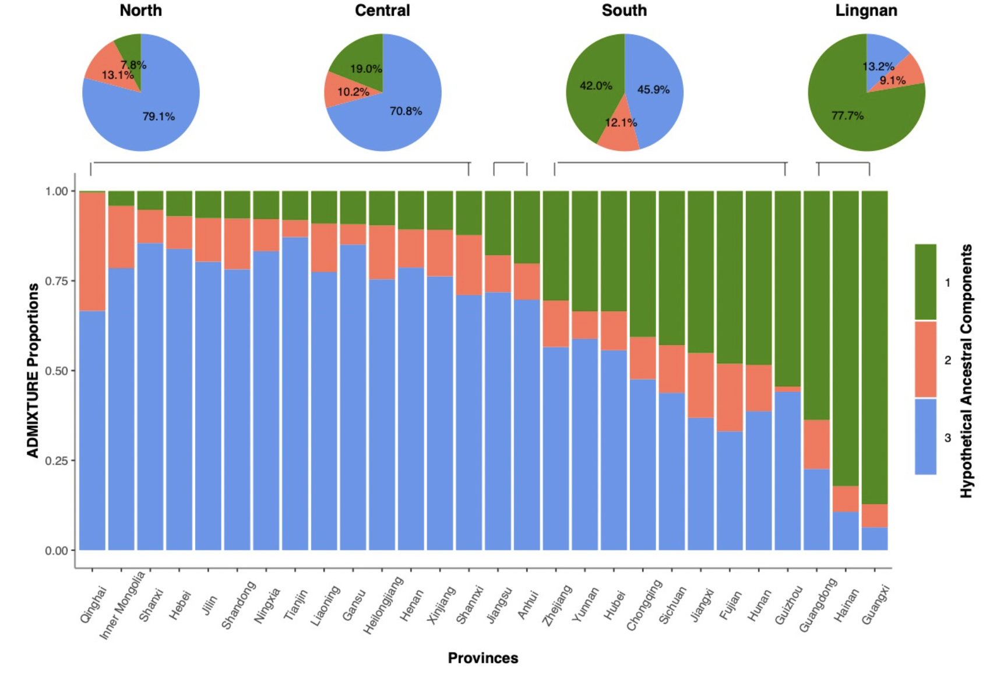
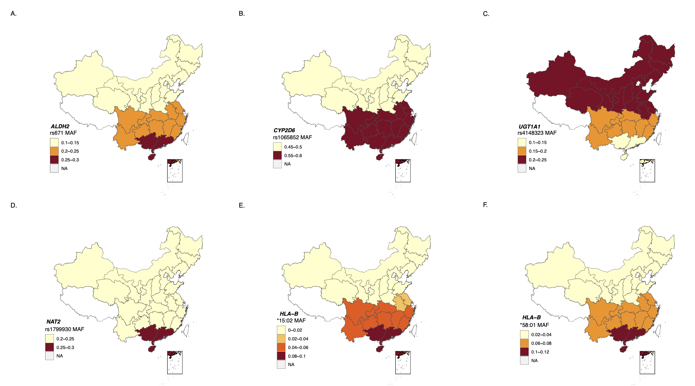

# Chinese2002WGS_PGx

This repository includes all in-house R scripts and part of shell scripts that used to analysze the  pharmacogenetic (PGx) germline genetic variation of 2002 Chinese individuals with Whole Genome Sequencing (WGS) data.

# Important Comments

1. Individual specific phenotype data (i.e., variation, gender, and birthplace) is not available due to data protection issues.

2. Grouped genotyping data (VCFs) could be available under the CNGB Sequence Archive under accession number CNP0003021 after contacting the administrator to get permission. Individual level genotyping data could not be provided due to protection issues.

3. The folder "test_data" only provides several examples that how the inupt looks like, and to help anyone would like to examine and understand the code. Test data would be uploaded once this study published.

4. The reference genome assembly untillized in this study is hg38/GRCh38.

#  Brief Imformation and Findings

The study population included 939 males,1060 females, and three not provided. Participant ages ranged from 21–65. The majority of participants (1902, 95%) were Han Chinese.

Meanwhile, 94 participants came from 19 different ethnic minority groups and 6 participants were unspecified.

Participant birthplaces were diverse and covered the 30 Chinese administrative districts, indicating a representative spread of the Chinese population.

We divided the 30 Chinese administrative districts into 4 subregions based on genetic features calculated using program PLINK and ADMIXTURE (k=3), which was illustrated as follow：

We also performed statistical analysis that potentially ifentified allele frequency significant variants among 4 subregions of China.

